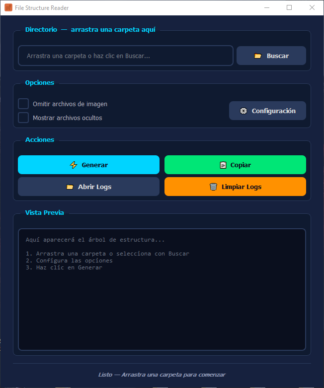

# 🦌 Pudu — File Structure Reader


**Pudu** es un generador de árboles ASCII que escanea la estructura de archivos de cualquier proyecto y la presenta con iconos emoji, filtros inteligentes y una interfaz moderna con tema oscuro. Perfecto para documentación, READMEs y compartir la organización de tu código.

---

## 📸 Vista Previa

<p align="center">
  
</p>

*Interfaz oscura con árbol de archivos, iconos por tipo y panel de configuración.*

---

## ✨ Características

* **📂 Escaneo Recursivo:** Lee directorios completos con profundidad configurable.
* **🎨 Iconos Emoji:** Cada tipo de archivo tiene su propio icono visual (🐍 .py, ⚛️ .tsx, 🎨 .css, etc).
* **⚙️ Configuración JSON:** Archivo `settings.json` flexible para personalizar todo el comportamiento.
* **🚫 Sistema de Filtros:**
    * Ignorar carpetas específicas (`node_modules`, `.git`, etc).
    * Ignorar archivos por nombre (`Thumbs.db`, `.DS_Store`).
    * Ignorar extensiones completas (`.log`, `.tmp`).
* **✅ Excepciones:** Anula cualquier filtro para archivos o carpetas que sí quieres mostrar.
* **🖼️ Filtro de Imágenes:** Opción para omitir archivos de imagen del árbol.
* **👁️ Archivos Ocultos:** Mostrar u ocultar archivos que empiezan con punto.
* **📋 Copiar al Portapapeles:** Un clic para copiar todo el árbol generado.
* **📁 Historial de Lecturas:** Cada escaneo se guarda automáticamente en `/logs`.
* **🗑️ Limpiar Logs:** Botón para borrar el historial desde la app.
* **📏 Profundidad Máxima:** Configura hasta qué nivel de carpetas escanear.
* **🎯 Interfaz Moderna:** Tema oscuro profesional optimizado para el flujo de trabajo.
* **⚙️ Ventana de Config:** Editor visual para modificar `settings.json` sin tocar archivos.

---

## 🛠️ Stack Tecnológico

* **Lenguaje:** Python 3.10+
* **Interfaz:** Tkinter + ttk
* **Configuración:** JSON
* **Distribución:** PyInstaller → `.exe` standalone

---

## 🚀 Cómo empezar

1. **Instalar dependencias:**
   ```bash
   pip install -r requirements.txt
   ```

2. **Ejecutar:**
   ```bash
   python main.py
   ```

3. **Compilar para producción (Windows):**
   ```bash
   pyinstaller build.spec
   ```

---

## ⚙️ Configuración

Edita `config/settings.json` para personalizar:

| Campo | Descripción |
|-------|-------------|
| `ignored_folders` | Carpetas a ignorar (`node_modules`, `.git`, etc) |
| `ignored_files` | Archivos específicos a ignorar (`Thumbs.db`) |
| `ignored_extensions` | Extensiones a ignorar (`.log`, `.tmp`) |
| `image_extensions` | Extensiones consideradas imagen |
| `exceptions` | Anular cualquier ignorado (forzar inclusión) |
| `max_depth` | Profundidad máxima (`-1` = sin límite) |
| `show_hidden_files` | Mostrar archivos ocultos (`true`/`false`) |
| `log_format` | Formato del nombre de los logs |

---

## 📂 Estructura del Proyecto

```text
├── assets/
│   ├── Pudu.ico         # Icono de la aplicación
│   ├── Pudu.png         # Logo
│   ├── favicon.ico      # Favicon
│   ├── icon.ico         # Icono Windows
│   ├── icon.png         # Icono PNG
│   └── view.png         # Captura de pantalla
├── config/
│   └── settings.json    # Configuración de filtros y opciones
├── core/
│   ├── __init__.py
│   ├── config_manager.py  # Lectura/escritura de settings.json
│   ├── file_manager.py    # Manejo de logs y archivos
│   └── scanner.py         # Motor de escaneo recursivo
├── ui/
│   ├── __init__.py
│   ├── config_window.py   # Ventana de configuración visual
│   ├── main_window.py     # Ventana principal
│   ├── styles.py          # Estilos y tema oscuro
│   └── widgets.py         # Componentes reutilizables
├── logs/                  # Historial de escaneos
├── main.py                # Entry point
├── build.spec             # Configuración PyInstaller
├── requirements.txt       # Dependencias
└── README.md              # Este archivo
```

---

## 🔗 Familia de herramientas

| Herramienta | Función | Stack |
|-------------|---------|-------|
| **Kondor** | Automatizador de proyectos desde .md | Python + Tkinter |
| **Condor Desktop** | IDE visual de automatización | Electron + React |
| **Pudu** | Generador de árboles de archivos | Python + Tkinter |

---

## 👤 Autor

Desarrollado con ❤️ en Chile por **CoipoNorte**.
> "Un poquito del sure en el norte de Chile"

---
